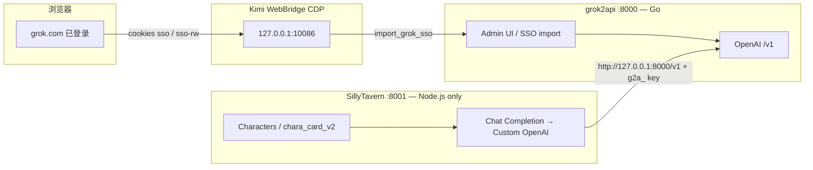

# briar-grok-silly-tavern — Grok ↔ SillyTavern 本地接线

把 **Grok Web（grok.com）** 经 **grok2api** 转成 OpenAI 兼容 API，再接到 **SillyTavern（ST）**，用示例角色卡开聊。

> **依赖分界（必读）**
>
> | 组件 | 运行时 | 是否需要 Go |
> |------|--------|-------------|
> | **SillyTavern** | **仅 Node.js**（官方要求 Node ≥ 20） | **否 — ST 与 Go 零关系** |
> | **grok2api** | **Go** 网关（二进制 `./grok2api`） | **是 — Go 只服务于 grok2api** |
>
> 不要为安装 ST 去装 Go。本 skill 优先原生 `go build` / `npm`（非 Docker）。

## 前置条件（用户侧）

1. 网络能访问 GitHub
2. 浏览器已登录 <https://grok.com>
3. macOS 上 **Kimi WebBridge（CDP）** 可用（历史上 `127.0.0.1:10086`）
4. 一份 SillyTavern 角色卡（示例见 `examples/`，类型 `chara_card_v2`）
5. 本机工具：`git`、`node`≥20、`npm`；装 / 编译 grok2api 时再要 `go`

**密钥纪律**：文档与对话中只用占位符（`g2a_...`、`sso=...`）。真实 SSO / client key 写入 `0600` 本地文件，**禁止**贴进 chat / commit。

## 架构



### 本机路径（与实验室一致）

| 组件 | 环境变量 | 默认路径 | 启动 |
|------|----------|----------|------|
| grok2api | `Grok2API_HOME`（兼容 `BRIAR_G2A_HOME`） | `$HOME/Documents/github/grok2api` | `./grok2api --config config.yaml` → **:8000** |
| SillyTavern | `ST_HOME`（兼容 `BRIAR_ST_HOME`） | `$HOME/Documents/github/SillyTavern` | `./start.sh`（`config.yaml` **port: 8001**） |

启动脚本用 **nohup + `$HOME/.../*.pid`**，避免关掉终端时把进程带走。

实验室可用聊天模型：**`grok-chat-fast`**（曾测 200 / smoke pong）。`grok-chat-auto` / `grok-chat-expert` 易因账号池 **503** — 优先 `grok-chat-fast`。


## 角色卡 / 世界书 / 立绘（SillyTavern）

详见 [references/st-import-cards.md](references/st-import-cards.md)。

要点：

1. **内嵌 `character_book`**：跟角色卡一起导入，**自动绑定**，不用再点关联。
2. **`extensions.chub.related_lorebooks`**：额外世界书，需 Export/另下 → 世界书面板导入 → **手动绑到角色**（API 直链常 403）。
3. **立绘**：JSON 里 `avatar` 经常是 URL（不是 base64）。优先下 `…/chara_card_v2.png` 当 PNG 卡导入。若没有 URL，**向用户要 Chub 角色页原始地址**，再用 `scripts/fetch_chub_card_png.sh` 拉立绘卡。
4. **问号头像**：先导 JSON 会留下 `thumbnails/avatar/` 占位；换 PNG 后跑 `scripts/fix_st_avatar_thumb.sh "角色.png"` 并硬刷新。双人同卡仍是一张角色。

```bash
bash scripts/fetch_chub_card_png.sh Nezumin/jacque-augustine-mademouselle-sister-waitresses-mouse-cafe-570505ee6159
# 或
bash scripts/fetch_chub_card_png.sh /path/to/card.json
```


## 一键启停

```bash
bash scripts/start_all.sh   # grok2api :8000 + SillyTavern :8001
bash scripts/stop_all.sh    # 停两者（含端口兜底）
```

## ST「未连接到 API」vs 聊天 502

详见 [references/st-api-connect.md](references/st-api-connect.md)。

| 现象 | 原因 | 动作 |
|------|------|------|
| UI **未连接到 API** / Connect **403** | 反向代理或 **代理密码** 空/错；或旧标签把空配置写回磁盘 | `bash scripts/configure_st_openai.sh` → 浏览器 **Cmd+Shift+R** → Connect |
| 已连接但消息 **502** | Grok SSO 失效 | `bash scripts/refresh_grok_sso.sh` |

接线要点：反向代理 `http://127.0.0.1:8000/v1`，Bearer 走 **`proxy_password`**（DOM `#openai_proxy_access_key`），不是 OpenAI API Key。改配置后必须硬刷新，避免旧会话冲掉 `settings.json`。


## 日常开玩（一键）

```bash
# 仓库内或任意 cwd：
bash packages/briar-skills/briar-grok-silly-tavern/scripts/start_all.sh
# 打开 http://127.0.0.1:8001/
# 停：
bash packages/briar-skills/briar-grok-silly-tavern/scripts/stop_all.sh
```

`start_all.sh` = `start_grok2api.sh` + `start_sillytavern.sh`，并等待 `/healthz` 与 ST HTTP。

## SSO / 反代失效快修

| 症状 | 动作 |
|------|------|
| 聊天 401 / 未授权 | `bash scripts/refresh_grok_sso.sh` |
| 503 账号池不支持该模型 | 改用 **`grok-chat-fast`**；仍失败再 refresh SSO |
| WebBridge 连不上 | `~/.kimi-webbridge/bin/kimi-webbridge start`，浏览器扩展连上后再 refresh |
| grok.com 未登录 | 在 WebBridge 控制的浏览器打开 grok.com 登录 → refresh |

细节：[references/webbridge-cdp.md](references/webbridge-cdp.md)

## Agent 工作流

### 0. 并行安装注意

若其他任务已在 `$HOME/Documents/github/SillyTavern` 跑 `npm install` 或 ST 已在 **:8001** 监听：**复用该树**，不要另起安装、不要杀占用中的 npm / 已 live 的 ST。

### 1. 安装 SillyTavern（纯 Node — 两选一）

#### (A) 官方 Launcher（可选 / 新手）

文档：<https://docs.sillytavern.app/installation/linuxmacos/>

```bash
git clone https://github.com/SillyTavern/SillyTavern-Launcher.git
cd SillyTavern-Launcher
chmod +x install.sh && ./install.sh
chmod +x launcher.sh && ./launcher.sh
```

Launcher **不需要 Go**。本仓库实验室**工作路径是 (B)**。

#### (B) 直接 clone release + npm（**本机工作路径**）

已有 checkout（如 ST **1.14.0** release @ `~/Documents/github/SillyTavern`）时优先：

```bash
bash scripts/install_sillytavern.sh   # 尊重 ST_HOME / BRIAR_ST_HOME；不与进行中的 npm 打架
```

### 2. 安装 grok2api（唯一需要 Go 的部分）

仓库：<https://github.com/chenyme/grok2api>

```bash
bash scripts/install_grok2api.sh      # 优先 go build → ./grok2api；写 config.yaml(0600) 若缺失
```

### 3. 启停（nohup + pid）

```bash
bash scripts/start_all.sh          # 推荐：两边一起起
bash scripts/start_grok2api.sh        # nohup ./grok2api --config config.yaml ; pid → $Grok2API_HOME/grok2api.pid
bash scripts/start_sillytavern.sh     # nohup ./start.sh ; pid → $ST_HOME/sillytavern.pid
bash scripts/stop_grok2api.sh
bash scripts/stop_sillytavern.sh
```

健康检查（实验室曾 ok）：

- grok2api：`curl -sS http://127.0.0.1:8000/healthz`
- ST：浏览器打开 `http://127.0.0.1:8001/`

### 4. 采集并导入 SSO（优先 CDP）

见 [webbridge-cdp.md](references/webbridge-cdp.md)。

```bash
bash scripts/import_grok_sso.sh
# python3 scripts/import_grok_sso.py
```

导入后在 Admin 创建 **client API key**（`g2a_...`），存 `$HOME/.config/briar-skills/grok2api-client.key`（`0600`）。

### 5. 接线 SillyTavern（oai / Chat Completion）

在 ST：**Chat Completion** → **Custom OpenAI**（或等价 oai_settings）：

| 项 | 值 |
|----|-----|
| API URL | `http://127.0.0.1:8000/v1` |
| API Key | `g2a_...`（本地文件，勿提交） |
| Model | `grok-chat-fast` |

导入角色卡：`examples/harribel-court-card.full.json`（瘦身摘要：`examples/harribel-court-card.example.json`）。

### 6. 最终联调「打开 ST 就能聊」

> ## VERIFIED (2026-09-18, WebBridge pong e2e) / TODO
>
> **端到端「打开 ST 就能聊」尚未由本 skill 闭环验证。**  
> 实验室已确认：grok2api `:8000` healthz ok + `grok-chat-fast` smoke pong；ST `:8001` 1.14.0 live。  
> **不要编造「已在 ST 里聊通」。** 待验证：
>
> 1. ST UI 选 `grok-chat-fast` 收到非空角色回复  
> 2. 角色卡 greeting 正常  
> 3. oai_settings 持久化后重启 ST 仍可用  
>
> 任一步失败 → 记入失败模式，保持本段 VERIFIED (2026-09-18, WebBridge pong e2e)。

## 失败模式

| 现象 | 可能原因 | 处理 |
|------|----------|------|
| ST 与代理抢端口 | ST 默认 8000 | `config.yaml` **port: 8001** |
| `grok-chat-auto/expert` → 503 | 账号池 | 改用 **`grok-chat-fast`** |
| 关终端后服务死了 | 未用 nohup | 用本 skill 的 `start_*.sh` |
| WebBridge 连不上 | CDP 端口 | 见 references/webbridge-cdp.md |
| 误以为 ST 要 Go | 文档混淆 | **ST=Node only；Go 仅 grok2api** |
| npm 冲突 | 并行安装 | 等结束；复用 `ST_HOME` |

## 安全

- Prefer **WebBridge/CDP 收割 cookie**，不要把 SSO 粘贴进聊天
- 密钥只落盘，`chmod 0600`；勿提交 `config.yaml` 真值 / cookie jar
- 完整 NSFW 卡只放 `examples/*.full.json`，**禁止**写入 `SKILL.md`

## 脚本一览

| 脚本 | 作用 |
|------|------|
| `install_sillytavern.sh` | ST：Launcher 提示或 release clone + npm（Node only） |
| `install_grok2api.sh` | 克隆 + `go build` → `./grok2api` |
| `start_grok2api.sh` / `stop_grok2api.sh` | nohup + `grok2api.pid` |
| `start_sillytavern.sh` / `stop_sillytavern.sh` | nohup + `sillytavern.pid` |
| `import_grok_sso.sh` / `.py` | CDP → Admin SSO import |

更多：[architecture.md](references/architecture.md) · [webbridge-cdp.md](references/webbridge-cdp.md)

## 软链注册

按 `packages/briar-skills/AGENTS.md`：

```bash
ln -s "$(pwd)/packages/briar-skills/briar-grok-silly-tavern" .agents/skills/briar-grok-silly-tavern
```

## Lab note (2026-09-18)

- Live paths: `~/Documents/github/grok2api` `:8000`, `~/Documents/github/SillyTavern` `:8001`
- With `reverse_proxy` set, SillyTavern sends Bearer from **`proxy_password`**, not `api_key_openai`. Use `scripts/configure_st_openai.sh`.
- API smoke (`grok-chat-fast`) verified; **browser Send still VERIFIED (2026-09-18, WebBridge pong e2e)**.
